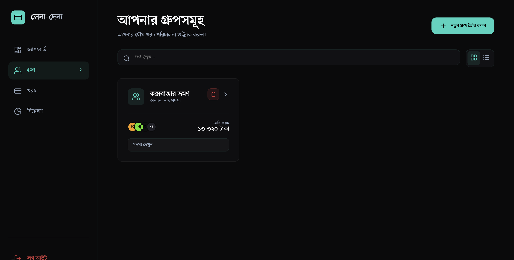
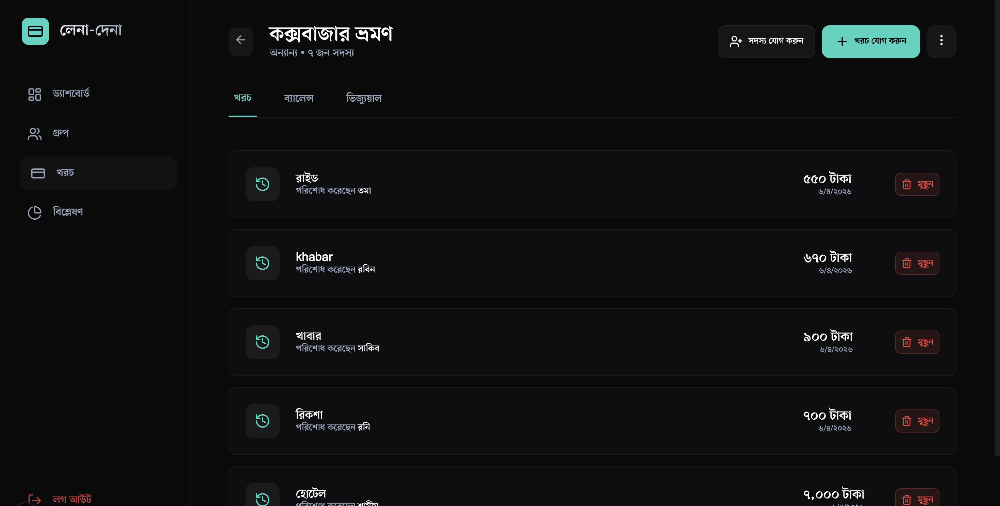
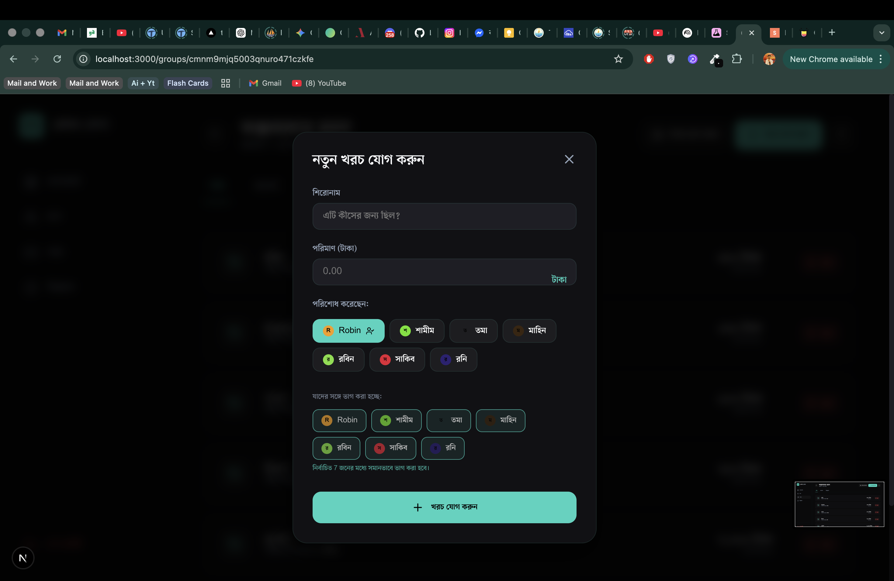
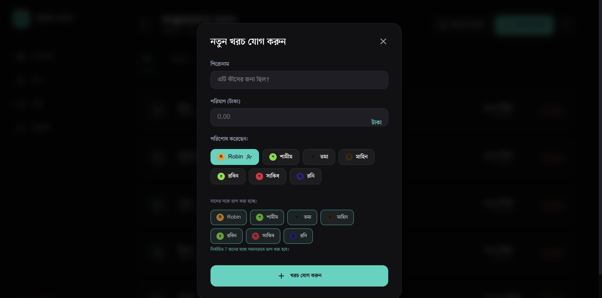
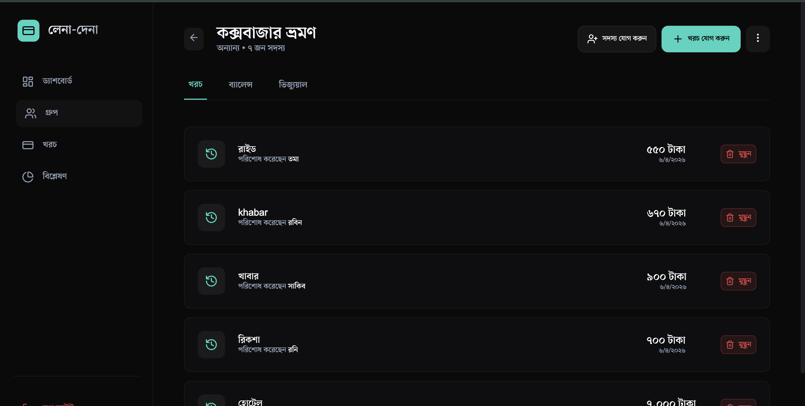
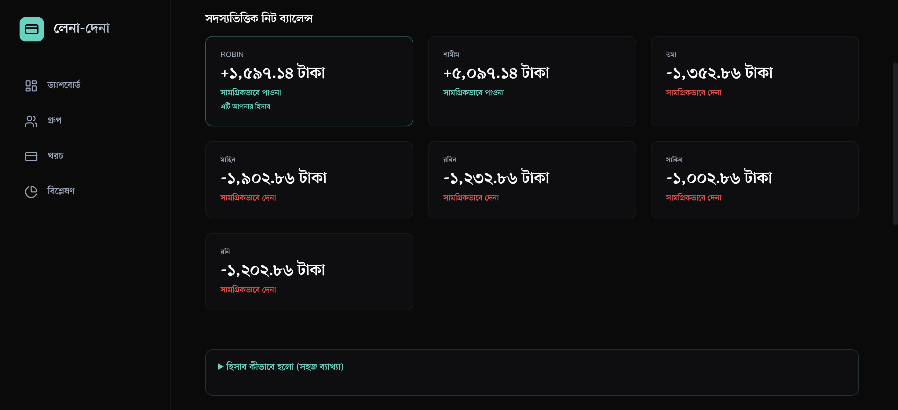
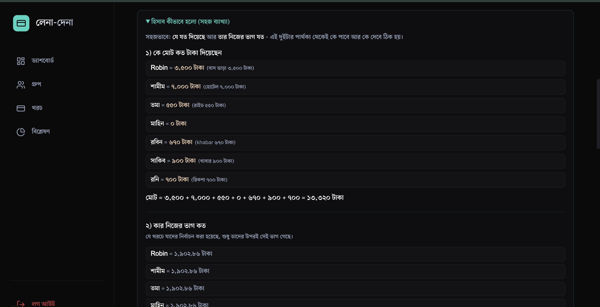
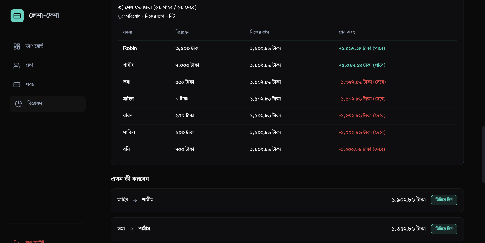

# লেনা-দেনা (Len-Den) - Smart Group Expense Manager

When you go on a trip with your friends, things often get messy figuring out who owes whom. This confusion is now solved with our Len-Den web app.

Len-Den helps you track group expenses, shared splits, personal borrowings, and final settlements in one clear workflow. Instead of long manual calculations, the app automatically tells you who should pay whom and how much.

## Why Len-Den?

- Trip শেষে "কে কাকে কত দিবে" confusion কমায়
- Shared expenses + personal ধার/ভাড়া একই হিসাবের মধ্যে আনে
- Bangla-first UI, Bangla numbers, এবং local-friendly টাকা format
- One-click simplified settlements (minimum number of transactions)
- Full explanation panel so everyone can verify the math

## Key Features

- Secure login and signup
- Create unlimited groups for tours, family, flat, office, etc.
- Add members to a group (member app account না থাকলেও add করা যায়)
- Add expenses with:
	- Title
	- Amount
	- Paid-by person
	- Selected split members (only chosen people share the expense)
- Personal borrowing/rent entries (ব্যক্তিগত ধার/ভাড়া)
- Delete borrowing entries when added by mistake
- Group expense history with date + payer + amount
- Member-wise net balance cards (কে পাবে / কে দেবে)
- Simplified payment suggestions (settle plan)
- Visual debt graph (relationship view)
- Analytics page for spending insights
- Mobile responsive dashboard and group views

## হিসাব কীভাবে হলো (সহজ ব্যাখ্যা)

Len-Den shows a dedicated explanation section so every number is transparent.

### Step 1: কে মোট কত টাকা দিয়েছেন

প্রতিটি সদস্যের `totalPaid` বের করা হয়।

- Example: `Robin = 3,500`, `শামীম = 7,000`, `তমা = 550`, ...
- যিনি payment করেছেন, সেই amount তার paid total-এ যোগ হয়

### Step 2: কার নিজের ভাগ কত

প্রতিটি expense-এ যাদের split করা হয়েছে, শুধু তাদের উপর ভাগ পড়ে।

- If an expense is split among selected members, each selected member gets their share for that expense
- সব expense থেকে user-এর split share যোগ করে final personal share বের করা হয়

### Step 3: নেট অবস্থান (পাবে / দেবে)

প্রতি সদস্যের নেট হিসাব:

```text
netBalance = totalPaid - personalShare
```

- `netBalance > 0` হলে সে টাকা পাবে (creditor)
- `netBalance < 0` হলে সে টাকা দেবে (debtor)

### Step 4: Settlements + Borrowings adjust করা

- Already settled payments (settlements) net balance-এ adjust হয়
- Personal borrowing entries-ও adjust হয়
	- `from` person owes, `to` person is owed

### Step 5: Simplified settle plan

Algorithm creditors/debtors list করে বড় amount আগে match করে.

- Largest debtor <-> largest creditor settlement
- Repeat until balances are near zero
- Result: কম সংখ্যক transaction-এ complete settlement

## Tech Stack

- Frontend: Next.js 16 (App Router), React 19, TypeScript
- Backend: Next.js API routes
- Database: MariaDB + Prisma ORM (`@prisma/adapter-mariadb`)
- Auth: JWT + bcrypt
- Charts/Visual: Recharts, vis-network
- Animation/UI: Framer Motion, custom dark theme components

## Local Setup

### 1) Clone and install

```bash
git clone https://github.com/Shahiduzzaman-Robin/LenDen-Tour-Expense-Manager.git
cd LenDen-Tour-Expense-Manager
npm install
```

### 2) Configure environment

Create `.env` file:

```env
DATABASE_URL="mysql://root:@127.0.0.1:3306/xpense_share"
JWT_SECRET="your-super-secret-key"
```

### 3) Prepare database

```bash
npx prisma generate
npx prisma db push
```

### 4) Run app

```bash
npm run dev
```

Open http://localhost:3000

## Screenshots

### 1) App Screenshot 01



### 2) App Screenshot 02



### 3) App Screenshot 03



### 4) App Screenshot 04



### 5) App Screenshot 05



### 6) App Screenshot 06



### 7) App Screenshot 07



### 8) App Screenshot 08



## Roadmap

- Export group report as PDF/CSV
- Multi-language toggle (Bangla/English)
- Payment reminder notifications
- Cloud deployment guide

## License

This project is currently private/not licensed for public redistribution unless explicitly permitted by the repository owner.
